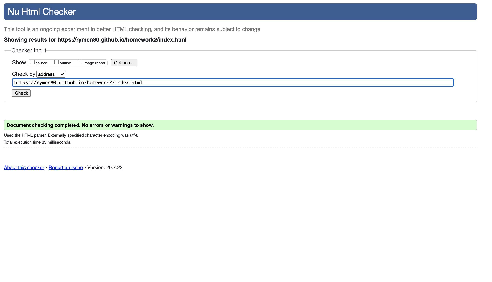

Fun with BOOTSRAP 

responsive  Bootstrap CSS Framework design that ensures web applications render well on a variety of devices and window or screen sizes. As a developer, you will likely be asked to create a mobile-first application or add responsive design to an existing application. 

Should be a portfolio site with images and links.
three files index.html. portfolio.html contact.html

basis to to practice using bootstrap AKA make sites responsive!

validation:

